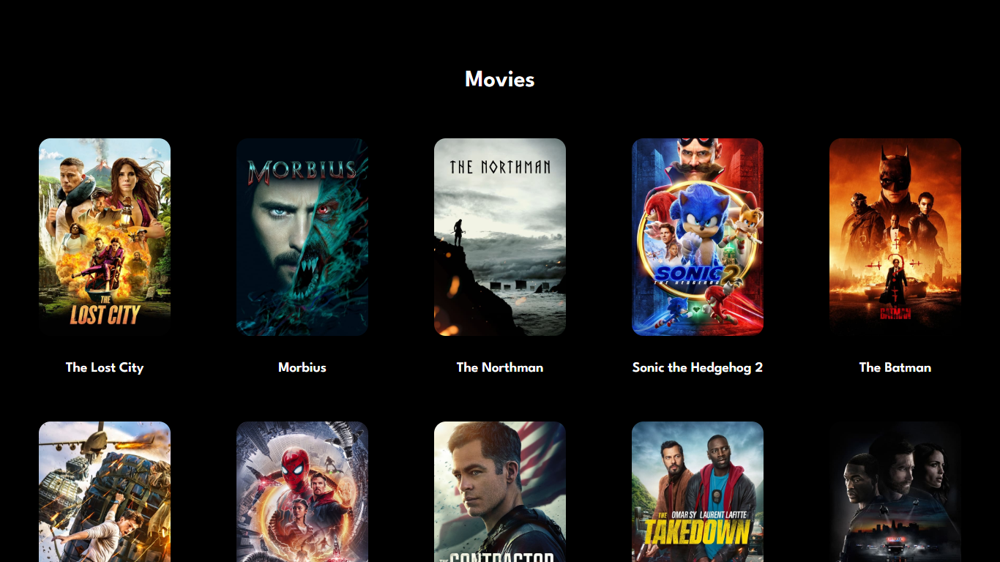
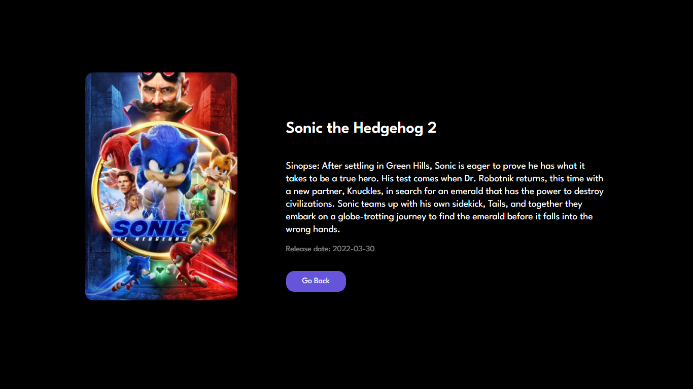

# Consuming an Movies API with React

Development of React Application that consume an MovieDB API for study purposes

-  [Consuming an Movies API with React](https://www.youtube.com/watch?v=PBrEq9Wd6_U&t=437s)

## 👀 At a Glance
| Screenshots                                         | Screenshot2                                              | 
| :------------------------------------------------:  | :------------------------------------------------------: | 
|                  |                       |


## 🛠 Set-up

1. Install the dependencies

   ```sh
   npm install or yarn
   ```

2. Start the development server

   ```sh
   yarn run start
   ```

## 🚀 build and run for production

1. Generate a full static production build

   ```sh
   npm run build
   ```


## Author

- [@ibtriz](https://www.github.com/ibtriz)


## Stack
   

## References

-  [Consuming an Movies API with React](https://www.youtube.com/watch?v=b6N29J_utw4&list=PLOzZAH_pgb_QGWVmQwkRFTYhHuG1qKHIR)